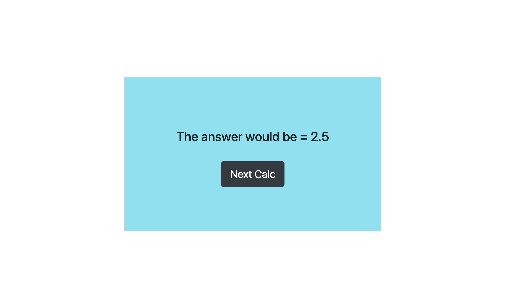

### Backend Calculator

This is a simple calculator which is made with the help of node frameworks.

    #####Frameworks used are:

        -express
        -body-parser
        -ejs
        -nodemon

#### Steps to make application working:

* Step 1: Download the file.
* Step 2: Go to the file path on terminal and type ```npm install``` or ```npm i```.
* Step 3: In the same path on terminal type ```node app.js``` or ```nodemon app.js```. 
* Step 4: Go to your browser and type http://localhost:3000.
* Step 5: Enjoy your calculator.

#### The calculator is capable doing some limited operations like:

         +  : Addittion 
         -  : Subtraction
         *  : Multiplication
         /  : Division
         ** : Power


#### Graphical interface:


